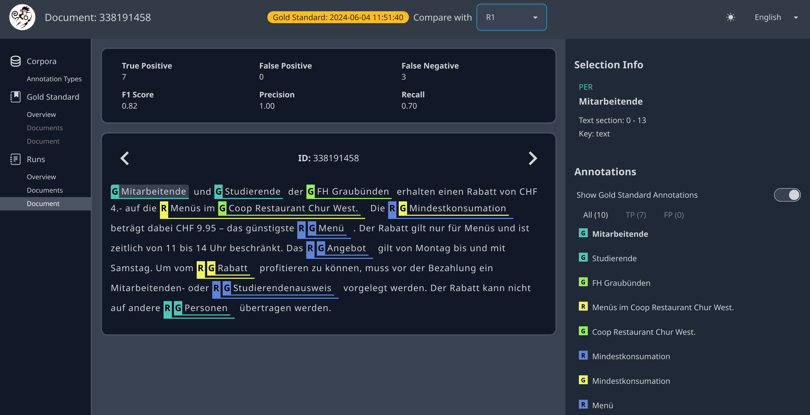

## Orbis Eval

Metrics such as F1, Recall and Precision lack the ability to identify specific data points that have been correctly or incorrectly classified. Orbis Eval offers a solution to this problem by providing a document-level visual comparison of predicted entities against the gold standard, specifically for Named Entity Recognition (NER) and Named Entity Linking (NEL). Users can import the gold standard directly from tools such as [Doccano](https://github.com/doccano/doccano) or [Label Studio](https://github.com/HumanSignal/label-studio).

